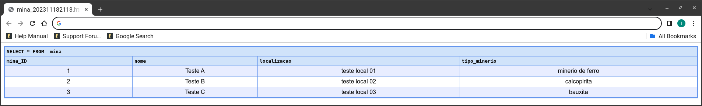

<style>
    
    @import url('https://fonts.googleapis.com/css2?family=Poppins:ital,wght@0,300;0,400;0,500;0,600;0,700;0,800;0,900;1,300;1,400;1,500;1,600;1,700;1,800;1,900&display=swap');

    * {
   font-family: 'Poppins', sans-serif;
     }

    h1,h2 {
        color:black;
        font-weight: 800;
     }

     p {
        font-weight: 600;

     }

    footer {
        color:black;
        font-size: 16px;
        font-weight: 800;
        text-decoration: none;
            }

    header {
        color:black;
        font-size: 16px;
        font-weight: 800;
    }


</style>

# Projeto Banco de Dados
<!-- _backgroundImage: linear-gradient(120deg, #a1c4fd 0%, #c2e9fb 100%); -->


---
## Construção do Banco de Dados
<!-- _backgroundImage: linear-gradient(120deg, #a1c4fd 0%, #c2e9fb 100%); -->

A construção do banco de dados foi realizada através do abaixo:

```SQL
CREATE DATABASE BR_Minerais;

```


---

## Construção das Entidades

As entidades foram construídas levando em conta o segmento da mineração, ficando assim em sinergia com o projeto do site. As entidades foram: Mina, Funcinário, Mineral e Produção.
<!-- _backgroundImage: linear-gradient(120deg, #a1c4fd 0%, #c2e9fb 100%); -->


---

## Relacionamentos

<!-- _backgroundImage: linear-gradient(120deg, #a1c4fd 0%, #c2e9fb 100%); -->
1.	Uma Mina pode produzir vários Minerais (relacionamento 1 para muitos entre Mina e Mineral).
2.	Um Funcionário pode estar associado a várias Produções, mas cada Produção está associada a um único Funcionário (relacionamento muitos para um entre Funcionário e Produção).
3.	Uma Produção está associada a uma Mina e a um Mineral específicos (relacionamento muitos para um entre Produção e Mina/Mineral).

---

## Terceira Forma Normal 3FN
<!-- _backgroundImage: linear-gradient(120deg, #a1c4fd 0%, #c2e9fb 100%); -->
Dizer que as tabelas estão na Terceira Forma Normal (3FN) envolve demonstrar que:

1. Cada tabela tem uma chave primária única:
   1. Garanta que cada tabela tenha uma chave primária claramente identificada. Isso garante a identificação única de cada linha na tabela.

---

<!-- _backgroundImage: linear-gradient(120deg, #a1c4fd 0%, #c2e9fb 100%); -->

2. Eliminação de dependências transitivas:
   1. Certifique-se de que não há dependências transitivas nos atributos. Por exemplo, se A -> B e B -> C, então A não deve depender de C.

3.	Atributos não chave dependem apenas da chave primária:
    1.	Todos os atributos não chave devem depender apenas da chave primária. Se houver atributos dependentes de outros atributos não chave, isso pode indicar uma violação da 3FN.

---

## Tabela Mina

<!-- _backgroundImage: linear-gradient(120deg, #a1c4fd 0%, #c2e9fb 100%); -->
A chave primária é MinaID.
A tabela não possui dependências transitivas e os atributos não chave (Nome, Localização, Tipo de Minério) dependem diretamente da chave primária.

```SQL
CREATE TABLE mina(
mina_ID int AUTO_INCREMENT PRIMARY KEY,
nome VARCHAR(50) NOT NULL,
localizacao VARCHAR(50) NOT NULL,
tipo_minerio VARCHAR(50) NOT NULL
);

```

---

## Tabela Mineral
<!-- _backgroundImage: linear-gradient(120deg, #a1c4fd 0%, #c2e9fb 100%); -->
A chave primária é MineralID.
Não há dependências transitivas, e os atributos não chave (Nome, Tipo, Grau de Pureza) dependem diretamente da chave primária.

```SQL
CREATE TABLE mineral(
mineral_ID int AUTO_INCREMENT PRIMARY KEY,
nome_mineral VARCHAR(50) NOT NULL,
tipo VARCHAR(50) NOT NULL,
grau_pureza VARCHAR(50) NOT NULL
);


```

---

## Tabela Funcionário
<!-- _backgroundImage: linear-gradient(120deg, #a1c4fd 0%, #c2e9fb 100%); -->
A chave primária é FuncionarioID.
Não há dependências transitivas, e os atributos não chave (Nome, Cargo, Salário, Departamento) dependem diretamente da chave primária.

```SQL


CREATE TABLE funcionario(
funcionario_ID int AUTO_INCREMENT PRIMARY KEY,
nome_funcionario VARCHAR(50) NOT NULL,
cargo VARCHAR(50) NOT NULL,
salario DOUBLE NOT NULL,
departamento VARCHAR(50) NOT NULL
);

```


---

# Tabela Produção
<!-- _backgroundImage: linear-gradient(120deg, #a1c4fd 0%, #c2e9fb 100%); -->

A chave primária é ProducaoID.
Não há dependências transitivas, e os atributos não chave (Data, Hora e Quantidade Extraída) dependem diretamente da chave primária.

As chaves estrangeiras (FK_MinaID, FK_MineralID, FK_FuncionarioID) referenciam diretamente as chaves primárias nas tabelas Mina, Mineral e Funcionário, respectivamente.

---
<!-- _backgroundImage: linear-gradient(120deg, #a1c4fd 0%, #c2e9fb 100%); -->
```SQL
CREATE TABLE producao(
producao_ID int AUTO_INCREMENT PRIMARY KEY,
data VARCHAR(10) NOT NULL,
hora VARCHAR(8) NOT NULL,
quant_extraida DOUBLE NOT NULL,
departamento VARCHAR(50) NOT NULL,
FK_MinaID INT NOT NULL,
FK_MineralID INT NOT NULL,
FK_FuncionarioID INT NOT NULL,
CONSTRAINT FOREIGN KEY (FK_MinaID)
REFERENCES mina (mina_ID),
CONSTRAINT FOREIGN KEY (FK_MineralID)
REFERENCES mineral (mineral_ID),
CONSTRAINT FOREIGN KEY (FK_FuncionarioID)
REFERENCES funcionario (funcionario_ID)
);


```

---

## Inserindo os dados - Tabela Mina
<!-- _backgroundImage: linear-gradient(120deg, #a1c4fd 0%, #c2e9fb 100%); -->
```SQL
INSERT INTO mina (nome, localizacao, tipo_minerio) VALUES ('Teste','teste local 01', 'minerio de ferro');
INSERT INTO mina (nome, localizacao, tipo_minerio) VALUES ('Teste','teste local 02', 'calcopirita');
INSERT INTO mina (nome, localizacao, tipo_minerio) VALUES ('Teste','teste local 03', 'bauxita');


```

---
<!-- _backgroundImage: linear-gradient(120deg, #a1c4fd 0%, #c2e9fb 100%); -->

## Inserindo os dados - Tabela Mineral

```SQL

INSERT INTO mineral (nome_mineral, tipo, grau_pureza) VALUES ('ferro','2', 'media');
INSERT INTO mineral (nome_mineral, tipo, grau_pureza) VALUES ('cobre','1', 'Alta');
INSERT INTO mineral (nome_mineral, tipo, grau_pureza) VALUES ('Aluminio','1', 'Alta');

```

---

## Inserindo os dados - Tabela Funcionários

<!-- _backgroundImage: linear-gradient(120deg, #a1c4fd 0%, #c2e9fb 100%); -->
```SQL
INSERT INTO funcionario (nome_funcionario, cargo, salario, departamento) VALUES ('Alfa','minerador', 3000, 'mineracao');
INSERT INTO funcionario (nome_funcionario, cargo, salario, departamento) VALUES ('Beta','minerador', 3002, 'mineracao');
INSERT INTO funcionario (nome_funcionario, cargo, salario, departamento) VALUES ('Gama','minerador', 3001, 'mineracao');

```

## Inserindo os dados - Tabela Produção

```SQL 
INSERT INTO producao (data, hora, quant_extraida, departamento, FK_MinaID, FK_MineralID, FK_FuncionarioID) VALUES ('01-08-2023','08:00hs', 3100, 'M3',1, 1, 1);
INSERT INTO producao (data, hora, quant_extraida, departamento, FK_MinaID, FK_MineralID, FK_FuncionarioID) VALUES ('02-08-2023','09:00hs', 30002, 'M2',2, 2, 2);
INSERT INTO producao (data, hora, quant_extraida, departamento, FK_MinaID, FK_MineralID, FK_FuncionarioID) VALUES ('03-09-2023','10:00hs', 30003, 'M3',3, 3, 3);

```

---

## Realizando consultas
<!-- _backgroundImage: linear-gradient(120deg, #a1c4fd 0%, #c2e9fb 100%); -->
### select * from mina



---
### select * from mineral
<!-- _backgroundImage: linear-gradient(120deg, #a1c4fd 0%, #c2e9fb 100%); -->


---
### select * from funcionario
<!-- _backgroundImage: linear-gradient(120deg, #a1c4fd 0%, #c2e9fb 100%); -->


---

### select * from producao
<!-- _backgroundImage: linear-gradient(120deg, #a1c4fd 0%, #c2e9fb 100%); -->


---

### Inner Join
<!-- _backgroundImage: linear-gradient(120deg, #a1c4fd 0%, #c2e9fb 100%); -->

```SQL
INNER JOIN mina
ON producao.producao_ID  = mina.mina_ID
RIGHT JOIN funcionario
ON FK_FuncionarioID = funcionario_ID 
WHERE producao.producao_ID = 2;
```


---
<!-- _backgroundImage: linear-gradient(120deg, #a1c4fd 0%, #c2e9fb 100%); -->

# Obrigado :smile:

slides criados com auxíio da extensão [Marp for VSCode](https://marp.app)